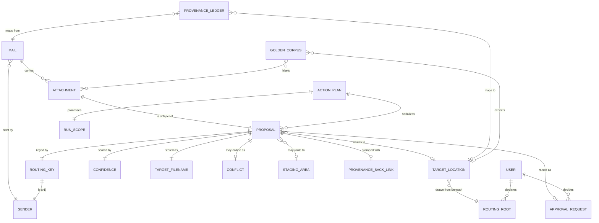

# Domain Model

Mode: Conceptual
Glossary: docs/CONTEXT.md

Models a single bounded context: **M2 · Attachment Auto-Router**. Conceptual mode
— no storage target is declared for these terms (ADR-0001 leaves the ledger's
physical form to the use-case spec; the Action Plan YAML is a surface/transport
format per ADR-0002; C-006/C-007 leave stack and mail-access TBD). Deferred M2b
terms (**Document Type**, **Naming Scheme**) are out of scope and not modeled
here — see *Terms intentionally not modeled*.

## Entity Relationship Diagram

### MAIL — Aggregate-root

One email message — the input the pipeline scans; carries zero or more Attachments and is never the unit of routing.

| Attribute  | Description                                               | Type                 | Validation Rules |
| ---------- | --------------------------------------------------------- | -------------------- | ---------------- |
| Message-ID | Portable, access-method-independent mail identity         | Identifier (natural) | Natural Identity |
| Sender     | The originating identity of the Mail (From email address) | Sender               | Not Null         |
| Sent At    | When the Mail was sent                                    | Timestamp            | Optional         |
| Subject    | The Mail subject line                                     | Text                 | Optional         |

**Constraints:** Carries zero or more Attachments. When Message-ID is absent, identity falls back to the synthetic `hash(from + date + subject)` so the mail stays addressable. Message-ID is never an IMAP UID or Graph item-ID (not portable).

### ATTACHMENT — Entity  [aggregate: Mail]

One file carried by one Mail — the atomic unit of routing and the subject of exactly one Proposal; distinct from the filed copy that lands in the Target Location.

| Attribute    | Description                                                    | Type                 | Validation Rules |
| ------------ | -------------------------------------------------------------- | -------------------- | ---------------- |
| content-hash | Hash of the file bytes — the dedup key and content fingerprint | Identifier (natural) | Natural Identity |
| Filename     | The original name of the file as carried by the Mail           | Text                 | Not Null         |

**Constraints:** Cannot exist without its Mail; full identity is rooted at the Mail — the pair `(Message-ID, content-hash)`. The content-hash alone is the **dedup key** and is *intentionally not globally unique*: two Attachments sharing a content-hash is exactly the dedup trigger (FR-012, C-010), resolved at the Provenance Ledger, not an identity collision. Every file the Mail carries is an Attachment; F01 may detect-but-filter inline images, footer logos, and signatures.

### PROPOSAL — Aggregate-root

A system-suggested filing action for exactly one Attachment into a Target Location, carrying its Confidence; it exists independently of any human and is the artifact the Golden Corpus grades.

| Attribute          | Description                                           | Type                 | Validation Rules                |
| ------------------ | ----------------------------------------------------- | -------------------- | ------------------------------- |
| Source Mail        | The Mail whose Attachment is being filed              | Identifier (natural) | Not Null, References MAIL       |
| Subject Attachment | The content-hash of the Attachment being filed        | Identifier (natural) | Not Null, References ATTACHMENT |
| Routing Key        | What F04 maps to a Target Location (the Sender in v1) | Routing Key          | Not Null                        |
| Target Location    | The proposed destination folder                       | Target Location      | Optional                        |
| Target Filename    | The name the filed copy is stored under               | Target Filename      | Not Null                        |
| Confidence         | The location-confidence of the routing decision       | Confidence           | Not Null                        |

**Constraints:**

- Natural identity is the pair `(Source Mail Message-ID, Subject Attachment content-hash)`; the Subject Attachment is referenced via this rooted key, never reaching into the Mail aggregate's internals (D2).
- A Proposal is the subject of **exactly one** Attachment.
- If the Confidence is below the configured threshold, or no Target Location maps (an unrecognized Sender), the Proposal routes to the Staging Area — with **0 auto-approvals below threshold** (NFR-001, CON-5). A multi-folder Sender is below-confidence by construction and an accepted miss (ADR-0003).
- The Attachment is copied to its Target Location **only after** an Approval Request returns approve (C-002 HITL); commit copies only — the source Mail and Attachment are never moved, deleted, or modified (C-001).
- Proposal completeness: Sender (via Routing Key), Target Location, Confidence, and Target Filename must all be present before the approval step (NFR-003 — M2 v1 fields; document-type and type-confidence are deferred to M2b).

### ACTION_PLAN — Aggregate-root

The batch serialization of all Proposals for one pipeline run — M2's plan/apply file that the User hand-edits and then `apply` executes for approved rows only.

| Attribute     | Description                                      | Type                 | Validation Rules |
| ------------- | ------------------------------------------------ | -------------------- | ---------------- |
| Run Timestamp | Identifies the pipeline run this plan serializes | Identifier (natural) | Natural Identity |
| Run Scope     | The set of Mails this run processed              | Run Scope            | Not Null         |

**Constraints:** Serializes every Proposal of one run; the User hand-edits it (rename / re-target / skip), and `apply` commits approved rows only. Shares its structure with the Golden Corpus.

### PROVENANCE_LEDGER — Aggregate-root

An external append record mapping `source Mail ↔ filed copy`, kept outside both the mailbox and the Target Locations; the single store serving both findability and dedup. Each table row below is one append record (its natural grain).

| Attribute           | Description                                                     | Type                 | Validation Rules          |
| ------------------- | --------------------------------------------------------------- | -------------------- | ------------------------- |
| Message-ID          | Identity of the source Mail the copy came from                  | Identifier (natural) | Not Null, References MAIL |
| content-hash        | Content fingerprint of the filed Attachment                     | Identifier (natural) | Not Null                  |
| Filed Copy Location | Where the copy was filed (Target Location plus Target Filename) | Text                 | Not Null                  |

**Constraints:**

- The **dedup decision** (write the file at all?) keys on **content-hash only** — a missing or reused Message-ID can never cause a duplicate file (NFR-002, C-010). Identical content is silently de-duplicated: only a new provenance link is appended, never a second copy (FR-012).
- The **provenance link** keys on `(Message-ID, content-hash)` (NFR-002).
- 100% of filed copies must be resolvable from **both** their Target Location and their source Mail via the ledger, **without any write-back to the mailbox** (C-001, C-008), and must stay resolvable after the User relocates the source Mail — lookups key on Message-ID, never on folder location (NFR-005).
- Append-only; in v1 resolution in either direction is manual ledger inspection (a greppable artifact, no dedicated lookup tool).

### GOLDEN_CORPUS — Aggregate-root

The labelled reference set the headless pipeline is graded against; each entry pairs an input Mail/Attachment with its correct outcome. It grades Proposals directly and never raises an Approval Request.

| Attribute               | Description                                                              | Type                 | Validation Rules                |
| ----------------------- | ------------------------------------------------------------------------ | -------------------- | ------------------------------- |
| Corpus Identity         | Names/versions the labelled reference set                                | Identifier (natural) | Natural Identity                |
| Subject Attachment      | The input Attachment an entry labels                                     | Identifier (natural) | Not Null, References ATTACHMENT |
| Correct Target Location | The correct folder by Sender, or absent for "Staging Area / no decision" | Target Location      | Optional                        |

**Constraints:** Grades Proposals directly and never raises an Approval Request. Landing in the Staging Area is scored as "no decision / deferred," never as a correct folder. Shares its structure with the Action Plan; F04 is graded against a **snapshot** of the Target Location set discovered beneath the Routing Roots.

### USER — Entity

The single actor — the Mailbox owner, who is also the approver of every Approval Request; ai-mail has one actor role throughout.

| Attribute     | Description                                                     | Type                 | Validation Rules |
| ------------- | --------------------------------------------------------------- | -------------------- | ---------------- |
| Mailbox Owner | The owner of the Mailbox and approver of every Approval Request | Identifier (natural) | Natural Identity |

**Constraints:** One actor role (owner = approver — never modeled as distinct operator / reviewer / admin roles). Declares one or more Routing Roots and decides every Approval Request. In v1 the Mailbox is the private mailbox only (C-004).

### APPROVAL_REQUEST — Entity

The runtime event of presenting a Proposal to the User for an approve / edit / reject decision — the human-in-the-loop gate (HumanLayer `require_approval` pattern).

| Attribute      | Description                                | Type                 | Validation Rules                        |
| -------------- | ------------------------------------------ | -------------------- | --------------------------------------- |
| Gated Proposal | The Proposal presented for decision        | Identifier (natural) | Not Null, References PROPOSAL           |
| Decision       | The User's approve / edit / reject outcome | Enum                 | Not Null, Values: Approve, Edit, Reject |

**Constraints:** Identity is the Gated Proposal (one decision per Proposal per run). Raised only on the human-in-the-loop path — corpus grading never raises one. An `Approve` decision is the precondition for committing the Proposal (C-002).

### TARGET_LOCATION — Value-Object

The place a Proposal routes its subject to — in M2, an existing folder on the local/network filesystem drawn from a closed set, never fabricated.

| Attribute   | Description                                        | Type | Validation Rules |
| ----------- | -------------------------------------------------- | ---- | ---------------- |
| Folder Path | An existing folder on the local/network filesystem | Text | Not Null         |

**Constraints:** Must be an existing folder beneath a Routing Root — leaf or intermediate, at any depth — and is never fabricated (C-003). The Staging Area is **not** a Target Location.

### STAGING_AREA — Value-Object

The holding place (`_review/`) for Attachments the pipeline could not confidently route — an explicit "no Target Location yet" outcome.

| Attribute | Description                 | Type | Validation Rules |
| --------- | --------------------------- | ---- | ---------------- |
| Location  | The `_review/` holding path | Text | Not Null         |

**Constraints:** Receives below-threshold-Confidence, unknown-mapping, and true-Conflict Attachments. The corpus scores landing here as "no decision / deferred," never as a correct folder. It is **not** a Target Location (CON-4 / CON-5).

### SENDER — Value-Object

The originating identity of a Mail, used as a routing key — in M2 v1 the From email address, verbatim.

| Attribute          | Description                           | Type                 | Validation Rules        |
| ------------------ | ------------------------------------- | -------------------- | ----------------------- |
| From Email Address | The verbatim From address of the Mail | Identifier (natural) | Not Null, Format: Email |

**Constraints:** Organization-level grouping (many addresses → one org) is deferred to M2b; an unrecognized address simply misses the map and routes to the Staging Area.

### ROUTING_KEY — Value-Object

What F04 maps to a Target Location — in M2 v1 the Sender alone (one-dimensional).

| Attribute | Description                                      | Type   | Validation Rules |
| --------- | ------------------------------------------------ | ------ | ---------------- |
| Sender    | The originating identity used as the routing key | Sender | Not Null         |

**Constraints:** One-dimensional in v1; Document Type as a second dimension is deferred to M2b. Single-valued only when each Sender files into one folder — a Sender that historically spans multiple folders is below-confidence by construction and routes to the Staging Area.

### CONFIDENCE — Value-Object

A per-decision score in [0,1] — in M2 v1 the single location-confidence (F04), how sure the router is of the folder.

| Attribute | Description                          | Type   | Validation Rules         |
| --------- | ------------------------------------ | ------ | ------------------------ |
| Score     | How sure the router is of the folder | Number | Not Null, Min: 0, Max: 1 |

**Constraints:** The Confidence gate compares the Score to the configured threshold; below it the Proposal routes to the Staging Area, with 0 auto-approvals below threshold (NFR-001). M2 v1 produces one Score (location); type-confidence and the `min(type, location)` gate are deferred to M2b.

### TARGET_FILENAME — Value-Object

The name the filed copy is stored under in its Target Location — a slot on every Proposal from v1.

| Attribute | Description                          | Type | Validation Rules |
| --------- | ------------------------------------ | ---- | ---------------- |
| Name      | The name the filed copy is stored as | Text | Not Null         |

**Constraints:** Defaults to the original Attachment name and is editable by the User in the Action Plan (free manual rename). On a same-path/different-content collision, F22 applies a deterministic mail-date prefix (`YYYY-MM-DD-<original>`) **once** as a tiebreaker before declaring a Conflict — a fixed rule, not the M2b Naming Scheme inference.

### PROVENANCE_BACK_LINK — Value-Object

The origin stamp carried with the filed copy (Message-ID, date, Sender); it answers the Copy→Mail direction.

| Attribute  | Description                                 | Type                 | Validation Rules |
| ---------- | ------------------------------------------- | -------------------- | ---------------- |
| Message-ID | Identity of the source Mail                 | Identifier (natural) | Not Null         |
| Mail Date  | Date of the source Mail                     | Date                 | Not Null         |
| Sender     | The originating identity of the source Mail | Sender               | Not Null         |

**Constraints:** Carried with the filed copy; its physical form (embedded metadata vs. sidecar) is deferred to the use-case spec (ADR-0001). Complements the Provenance Ledger, which answers Mail→Copy.

### CONFLICT — Value-Object

The terminal state where a Proposal would write **different** bytes to a path that is *still* occupied after the deterministic tiebreaker.

| Attribute      | Description                                                 | Type | Validation Rules |
| -------------- | ----------------------------------------------------------- | ---- | ---------------- |
| Colliding Path | The Target Location path that still holds different content | Text | Not Null         |

**Constraints:** Declared only when the mail-date-prefixed path *also* holds different bytes; it routes to the Staging Area, never committed or auto-overwritten (C-010). Distinct from dedup — identical content (same content-hash) is silently de-duplicated, not a Conflict. The in-plan rename / overwrite / skip resolution workflow is deferred (FR-013).

### RUN_SCOPE — Value-Object

The set of Mails one pipeline run processes — a trigger/adapter concern; the core just consumes a set of Mails.

| Attribute     | Description                           | Type | Validation Rules |
| ------------- | ------------------------------------- | ---- | ---------------- |
| Source Folder | The User-specified folder a run scans | Text | Not Null         |
| Date Range    | An optional narrowing window          | Date | Optional         |

**Constraints:** An efficiency choice, never a correctness one — re-scanning is always safe because dedup keys on content-hash (NFR-002). Date-range narrowing and "since last run" incrementality are deferred optimizations.

### ROUTING_ROOT — Value-Object

A folder the User declares as a scanning root (e.g. `D:\Documents\Filing`); the closed set of valid Target Locations is every existing folder discovered beneath it.

| Attribute | Description                     | Type | Validation Rules |
| --------- | ------------------------------- | ---- | ---------------- |
| Root Path | The declared scanning root path | Text | Not Null         |

**Constraints:** Target Locations are drawn from existing folders beneath the Routing Roots — leaf and intermediate, at any depth (CON-4: existing only, never fabricated). New subfolders join the set automatically on the next run; the corpus grades F04 against a snapshot of the discovered set.

## Terms intentionally not modeled as data entities

- **Approval Surface** — a thin, swappable *adapter* that renders Proposals and returns decisions; it is an architectural component, not domain data. No routing or approval logic lives in it (C-009, ADR-0002), so modeling it as an entity would leak infrastructure into the domain (A9). The domain contract it adapts is the **Proposal**.
- **Document Type** *(M2b)* and **Naming Scheme** *(M2b)* — deferred out of M2 scope (ADR-0003; FR-003 deferred). M2 v1 routes by Sender alone, so no Document Type is produced and the Routing Key stays one-dimensional. Not pulled in here.
