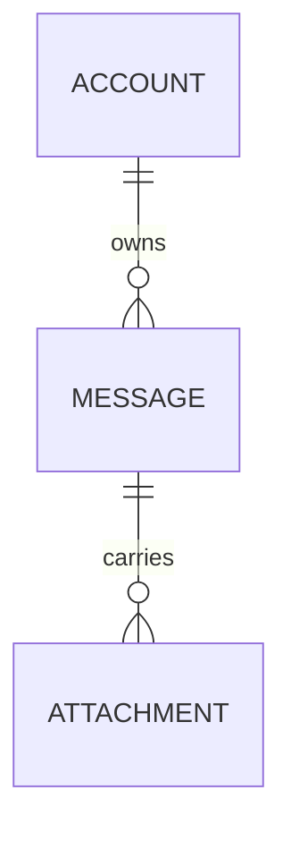

# Domain Model

Produces `docs/entity_model.md`: a conceptual domain model with a Mermaid ER
diagram, one attribute table per domain term, an Entity/Value-Object/Aggregate
classification, and explicit validation rules derived from implied invariants.

The filename stays `docs/entity_model.md` (not `domain_model.md`): it is the
AIUP-chain contract that downstream skills (use-case-spec, trace-check) read.

This skill models **one bounded context**. If the glossary spans multiple
bounded contexts, model a single context per run; do NOT silently merge terms
that collide across contexts — flag the collision instead (gr_ddd D7,
gr_domain_language L7).

## Inputs

- **`docs/requirements.md`** (required) — the source of domain terms and implied
  invariants. If it is absent, STOP and tell the user it is the required source;
  do not fabricate terms from nothing. (Only the glossary has a fallback chain;
  the requirements source does not.)
- **`docs/adr/*`** (read) — architecture decision records, scanned for implied
  business rules and for an explicit storage-target declaration (see Mode).
- **Glossary** (optional) — resolved by the chain in Glossary Resolution.

## Instructions

Create or update the domain model at `docs/entity_model.md`, derived from the
inputs above. The document contains an ER diagram and per-term attribute tables.
Model **conceptually first** (see Mode): model meaning, identity, and invariants
— never storage or transport mechanics — unless a storage target is explicitly
declared.

### Glossary Resolution (argument)

Accept an OPTIONAL glossary path as an argument.

1. If a glossary path is given as an argument, use it.
2. Otherwise resolve in order: `docs/CONTEXT.md`, then `docs/glossary.md`.
3. If none exists, WARN ("No glossary found; proceeding without one — terms
   cannot be verified verbatim, output quality is degraded"), record
   `Glossary: none (proceeding without)` in the document header, add a one-line
   warning note at the top of the document body, and proceed by extracting
   candidate terms from `docs/requirements.md`. Recommend re-running once a
   glossary exists.

Never hard-code a single glossary filename. Always try the resolution order.

When a glossary is present, use its terms **verbatim** as entity / value-object
/ aggregate names and as attribute names where the glossary names them. Do not
abbreviate, translate, pluralize, re-case, or invent synonyms
(gr_domain_language L1, L2).

### Classify every term (Entity / Value-Object / Aggregate-root)

For EACH domain term, decide its tactical-DDD kind. Do not default everything to
"a table with an `id`".

| Kind            | Test                                                                                       | Identity                          |
|-----------------|--------------------------------------------------------------------------------------------|-----------------------------------|
| Value-Object    | Defined entirely by its attribute values; two with equal values are interchangeable        | None — compared by value (D5)     |
| Entity          | Has a continuous domain identity that persists as its attributes change                    | Domain identity (a natural key)   |
| Aggregate-root  | An Entity that is the consistency boundary owning a cluster of entities/value-objects       | Domain identity; guards the cluster |

Value-objects are **immutable** and have **no identity** (D5): model them with
an attribute table like any other term, but give them NO surrogate identity
column.

#### Selecting the aggregate-root (D2)

The hard call is not Entity-vs-VO but *which* entity is a root and where the
aggregate boundary falls. Work it out, do not guess:

1. **Find the consistency clusters.** Group terms that must change together to
   stay valid — where one term's invariant references another (e.g. "a Message
   belongs to exactly one Account"; "an Attachment cannot exist without its
   Message").
2. **The root is the term outside terms reference.** Within a cluster, the
   aggregate-root is the single member that other aggregates hold a reference
   to. Internal members are reached only *through* the root, never referenced
   directly from outside.
3. **The root owns the spanning invariants.** Any invariant that ranges over
   more than one member of the cluster is enforced at the root (it is the
   consistency boundary).
4. **Default to standalone, not to root.** A term with no owned cluster is a
   plain Entity (or VO), not an aggregate-root. Do not promote every Entity to a
   root, and do not flatten a genuine cluster into unrelated standalone entities.

*Worked example.* `Account ||--o{ Message` and `Message ||--o{ Attachment`. An
`Attachment` has no identity outside the `Message` that owns it and is never
referenced from outside that message — so **`Message` is the aggregate-root**,
`Attachment` is a **non-root member** (`[aggregate: Message]`), and any
"total attachment size ≤ N" invariant lives on `Message`. `Account` is a
separate aggregate-root; the relationship from `Message` points to the
`Account` root, not into its internals.

### Turn implied invariants into validation rules

Read `docs/requirements.md` and ADRs for implied business rules ("must be
unique", "cannot be negative", "at most one active per account", "received not
before sent"). Make each one an **explicit** validation rule, and assign it to
the domain type that owns it — keeping the rule *inside* the domain model is D1
(keep domain rules inside the domain) at the conceptual level (also D3, D9):

- Single-attribute invariants go in that attribute's "Validation Rules" column.
- Multi-attribute / cross-entity invariants go in a **Constraints** note under
  the table — these are the aggregate's construction-time invariants (D3: an
  instance cannot exist in an invalid state).
- An aggregate-root's table/Constraints carry the invariants that span its
  members (D2): the boundary is where consistency is enforced.

For systematic recall of invariants (retention, concurrency, uniqueness, …),
run `hidden-constraint-sweep` over the same requirements — this skill captures
the invariants it finds, it is not itself the exhaustive sweep.

**Never leave a Validation Rules cell empty — but never invent a constraint to
fill it.** Use `Optional` when the requirements are silent about a field. State
`Not Null`, ranges, allowed-values, or formats **only** when the source actually
implies them. A filled cell must reflect a real constraint or a genuine absence
(`Optional`), not a manufactured `Not Null`/range that the requirements never
stated.

## Mode: Conceptual vs. Physical

This is the single authoritative statement of the storage rule; it governs the
`Type` column, the `DO NOT` datatype ban, and the cross-validation pass.

**Conceptual mode is the default.** Model meaning, identity, and invariants.
Attribute table columns are `Attribute | Description | Type | Validation Rules`.
`Type` uses **conceptual** types only (see Conceptual Type Reference) — no
lengths, no precision, no `Primary Key`/`Foreign Key`/`Sequence`. Identity is a
**natural domain key** named in the ubiquitous language, never a surrogate row
id or auto-increment sequence (A9).

**Physical mode** is used **only** when a storage target is *declared*. A
storage target is declared only when a requirement or ADR makes a **persistence
decision for these entities** — it names a concrete database, ORM, or states the
terms are stored/persisted as relational tables or documents. An *incidental*
technology mention (e.g. "PostgreSQL" referenced in passing, a tech named in an
unrelated ADR) does **not** count. **When in doubt, stay conceptual.**

Only in physical mode:

- Attribute table columns become `Attribute | Description | Data Type | Length/Precision | Validation Rules`.
- Storage datatypes (`Long`, `Decimal`, `String`, `Boolean`, `Integer`) and keys
  (`Primary Key`, `Foreign Key`, `Sequence`) become permitted, per the
  references below.
- State the declared storage target in the document header and which
  ADR/requirement declares it.

Mixed is allowed: model conceptually, and add physical detail only for the
specific terms a declared storage target covers. Even in physical mode, a
term's **name** stays domain-shaped — see the L4 rule in DO NOT.

## DO NOT

- Force a surrogate `id` column onto every term. Identity is modeled only for
  Entities/Aggregate-roots, and as a natural domain key — not as `Long` +
  `Primary Key, Sequence`. Value-objects get NO identity column.
- Emit physical/storage datatypes or keys (`Long`, `Decimal`, `Sequence`,
  `Primary Key`, `Foreign Key`, length/precision) in conceptual mode — they
  appear only behind a declared storage target (see Mode).
- Name a term after its storage or transport shape (`MessageRow`, `OrderDTO`,
  `AccountTable`, `MessagePayload`). Names reflect behavior and meaning, not
  storage (gr_domain_language L4). This is distinct from the datatype ban above:
  the term *name* stays domain-shaped even in physical mode.
- Leak infrastructure into the model (storage keys, transport ids, framework
  types, message-broker ids, file/network handles, HTTP fields, environment
  access) — A9.
- Invent terms or synonyms; use glossary terms verbatim. If a genuinely-new
  structural concept is needed, FLAG it for the glossary (loop back via the
  ubiquitous-language-guard) rather than coining it here (gr_domain_language L6).
- Maintain or edit the glossary, cut scope, gate ADRs, or sweep constraints —
  those belong to other skills. This skill only models.
- Add attributes/columns inside the Mermaid diagram entity blocks.
- Write prose like "Key attributes: name, email...".
- Create a free-standing "Relationships" table.
- Skip the attribute tables.

## Document Structure

This template is the single source for the per-term format; the Workflow and the
Mermaid rules reference it rather than restating it.

````markdown
# Domain Model

Mode: Conceptual            <!-- or: Physical (storage target: <X>, per <ADR/req>) -->
Glossary: docs/CONTEXT.md   <!-- resolved path, or "none (proceeding without)" -->

## Entity Relationship Diagram



### TERM_NAME — Aggregate-root | Entity | Value-Object  [aggregate: ROOT]

One sentence describing the term in domain language.

| Attribute | Description | Type | Validation Rules     |
|-----------|-------------|------|----------------------|
| ...       | ...         | Text | Not Null             |

**Constraints:** cross-attribute or aggregate invariants, if any.
````

Every term MUST have, in this order:

1. A `###` heading `TERM_NAME — <Kind>`, plus `[aggregate: ROOT_NAME]` if it
   belongs to an aggregate it does not root.
2. A one-sentence description in domain language.
3. An attribute table (conceptual columns by default; physical columns only in
   physical mode). Give an identity row only to Entities/Aggregate-roots.
4. A **Constraints** note when an invariant spans attributes or members, e.g.:
   `**Constraints:** A Message's received-at must not be before its sent-at.`

(In physical mode the table gains the `Data Type` and `Length/Precision` columns
shown in Mode.)

## Mermaid Diagram Rules

- Use glossary names **verbatim** as the node names.
- Show term names and relationships ONLY — NO attributes inside entity blocks.
- Relationships point to the **aggregate-root**, not to internal members (D2).
- Syntax: `TERM_A ||--o{ TERM_B : "relationship"`.

## Validation Rules Reference (conceptual)

Use these in the **Validation Rules** column (never leave empty; never invent —
see the rule above):

| Attribute role            | Validation Rules value             |
|---------------------------|------------------------------------|
| Natural identity          | Natural Identity                   |
| Required field            | Not Null                           |
| Unique field              | Not Null, Unique                   |
| Reference to another term | Not Null, References ROOT          |
| Optional field            | Optional                           |
| With range                | Not Null, Min: X, Max: Y           |
| With allowed values       | Not Null, Values: A, B, C          |
| Email                     | Not Null, Format: Email            |

Note the two identity-related strings are **different columns**: the **Type** of
an identity attribute is `Identifier (natural)` (Conceptual Type Reference); its
**Validation Rules** value is `Natural Identity`. Type says *what the value is*;
Validation says *that it is the identity*.

In physical mode (declared storage target only) the Validation Rules MAY become
`Primary Key, Sequence` for surrogate keys and `Foreign Key (TABLE.<key>)` for
references — never otherwise.

## Conceptual Type Reference

| Type                | Usage                                            |
|---------------------|--------------------------------------------------|
| Text                | Names, descriptions, free text                   |
| Number              | Counts, whole numbers                            |
| Amount              | Monetary values                                  |
| Quantity            | Measured quantities                              |
| Flag                | True/false                                       |
| Date / Timestamp    | Calendar date / point in time                    |
| Identifier (natural)| A domain key (e.g. email, ISBN), NOT a row id    |
| <ValueObject> / Enum| A named value-object or enumeration              |

Physical datatypes (`Long 19`, `String 50`, `Decimal 10,2`, `Boolean 1`,
`Integer 10`, etc.) are reserved for physical mode behind a declared storage
target.

## Workflow

1. Read `docs/requirements.md` (STOP if absent — it is required), `docs/adr/*`,
   and resolve the glossary (argument → `docs/CONTEXT.md` → `docs/glossary.md` →
   warn). Determine mode per **Mode**: physical only if a storage target is
   explicitly declared for these entities; otherwise conceptual.
2. List the candidate terms — from the glossary verbatim if present, else
   extracted from requirements. Use TodoWrite to create a task per term.
3. Classify each term (Value-Object / Entity / Aggregate-root) using the
   classification table and the aggregate-root selection procedure; note each
   member's owning aggregate. Drop nothing in scope; pull in nothing out of
   scope or deferred.
4. Write the document header (Mode, Glossary) and the ER diagram —
   relationships only, verbatim names, pointing to aggregate-roots.
5. For each term, produce the section per **Document Structure** (heading +
   kind + aggregate, one-sentence description, attribute table, Constraints).
   Give identity only to Entities/Aggregate-roots, as `Natural Identity`. Turn
   each implied invariant into an explicit Validation Rule; put cross-attribute
   or aggregate invariants in **Constraints**. Mark the todo complete.
6. Cross-validate the document:
   - Every term in the ER diagram has a matching attribute-table section, and
     vice versa.
   - Every term is classified Entity / Value-Object / Aggregate-root.
   - No value-object has an identity column; no term has a forced surrogate `id`.
   - In conceptual mode: no storage datatypes, PK/FK/Sequence, or
     length/precision anywhere.
   - No infrastructure/transport/storage fields leaked into any term (A9); no
     term is named after a storage/transport shape (L4).
   - Every relationship targets an aggregate-root (D2).
   - All references point to existing terms; all node/attribute names match the
     glossary verbatim.
   - No Validation Rules cell is empty, and none states an invented constraint
     the source did not imply.
   - No out-of-scope or deferred term was pulled in (A10: no speculative
     entity/column added "in case").
