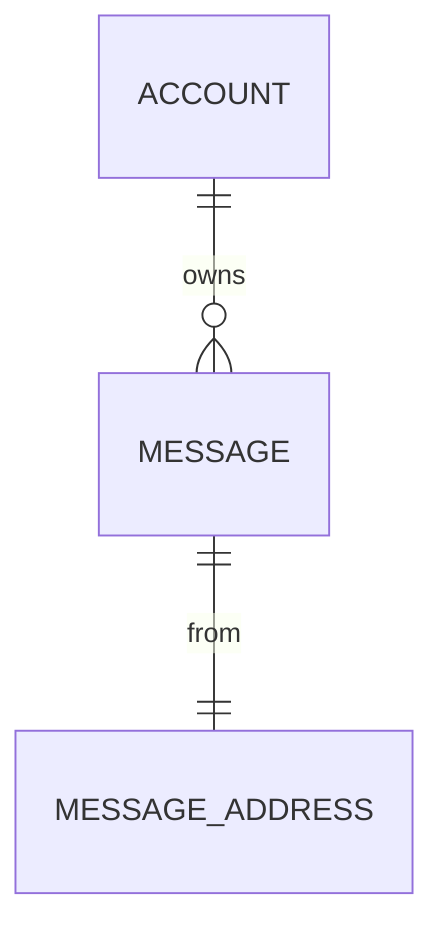

# Domain Model

Produces `docs/entity_model.md`: a conceptual domain model with a Mermaid ER
diagram, one attribute table per domain term, an Entity/Value-Object/Aggregate
classification, and explicit validation rules derived from implied invariants.

The filename stays `docs/entity_model.md` (not `domain_model.md`): it is the
AIUP-chain contract that downstream skills (use-case-spec, trace-check) read.

## Instructions

Create or update the domain model at `docs/entity_model.md`, derived from
`docs/requirements.md`, any architecture decision records under `docs/adr/*`,
and the project glossary (see Glossary Resolution below). The document contains
an ER diagram and per-term attribute tables.

Model **conceptually first**. The default mode is conceptual: model meaning,
identity, and invariants — never storage or transport mechanics. Physical
datatypes and storage artifacts appear ONLY when a storage target is explicitly
declared (see Conceptual vs. Physical Mode).

### Glossary Resolution (argument)

Accept an OPTIONAL glossary path as an argument.

1. If a glossary path is given as an argument, use it.
2. Otherwise resolve in order: `docs/CONTEXT.md`, then `docs/glossary.md`.
3. If none of these exists, WARN the user ("No glossary found; proceeding
   without one — terms cannot be verified verbatim") and proceed without one.

Never hard-code a single glossary filename. Always try the resolution order.

When a glossary is present, use its terms **verbatim** as the entity / value-
object / aggregate names and as attribute names where the glossary names them.
Do not abbreviate, translate, pluralize, or re-case glossary terms. Do not
invent synonyms (gr_domain_language L1, L2, L4).

### Classify every term (Entity / Value-Object / Aggregate-root)

For EACH domain term, decide its tactical-DDD kind. Do not default everything to
"a table with an `id`".

| Kind            | Test                                                                                       | Identity                          |
|-----------------|--------------------------------------------------------------------------------------------|-----------------------------------|
| Value-Object    | Defined entirely by its attribute values; two with equal values are interchangeable        | None — compared by value (D5)     |
| Entity          | Has a continuous domain identity that persists as its attributes change                    | Domain identity (a natural key)   |
| Aggregate-root  | An Entity that is the consistency boundary owning a cluster of entities/value-objects       | Domain identity; guards the cluster |

Rules:

- Value-objects are **immutable** and have **no identity** (D5). They are first-
  class: model them with an attribute table like any other term — they do NOT
  need and must NOT be given a surrogate identity column.
- An aggregate-root is the only member of its aggregate that outside terms
  reference; relationships from other aggregates point to the **root**, not to
  internal members (D2). Note each term's owning aggregate.
- Mark each term's kind in its section heading (see Document Structure).

### Turn implied invariants into validation rules

Read requirements and ADRs for implied business rules ("must be unique", "cannot
be negative", "at most one active per account", "end after start"). Make each
one an **explicit** validation rule (D3, D9):

- Single-attribute invariants go in that attribute's "Validation Rules" column.
- Multi-attribute / cross-entity invariants go in a **Constraints** note under
  the table — these are the aggregate's construction-time invariants (D3: an
  instance cannot exist in an invalid state).
- An aggregate-root's table/Constraints carry the invariants that span its
  members (D2): the boundary is where consistency is enforced.
- Never leave a Validation Rules cell empty.

### Keep infrastructure out of the model (A9)

Model **domain identity**, never a transport or storage id. Persistence keys,
auto-increment sequences, surrogate row ids, framework types, message-broker
ids, file paths, HTTP/transport fields, and environment access must NOT appear
in conceptual mode. An entity's identity is a **natural domain key** named in
the ubiquitous language, not a `Primary Key` / `Sequence`.

## DO NOT

- Force a surrogate `id` column onto every term. Identity is modeled only for
  Entities/Aggregate-roots, and as a natural domain key — not as `Long` +
  `Primary Key, Sequence`. Value-objects get NO identity column.
- Emit physical/storage datatypes (`Long`, `Decimal`, `Sequence`, `Primary
  Key`, `Foreign Key`, length/precision) in conceptual mode. They appear ONLY
  when a storage target is explicitly declared.
- Leak infrastructure into the model (storage keys, transport ids, framework
  types, file/network handles) — A9.
- Invent terms or synonyms; use glossary terms verbatim. If a genuinely-new
  structural concept is needed, FLAG it for the glossary (loop back via the
  ubiquitous-language guard) rather than coining it here (D-language L6).
- Maintain or edit the glossary, cut scope, gate ADRs, or sweep constraints —
  those belong to other skills. This skill only models.
- Add attributes/columns inside the Mermaid diagram entity blocks.
- Write prose like "Key attributes: name, email...".
- Create a free-standing "Relationships" table.
- Skip the attribute tables.

## Conceptual vs. Physical Mode

**Conceptual mode (default).** Use when no storage target is declared.

- Attribute table columns: `Attribute | Description | Type | Validation Rules`.
- `Type` uses **conceptual** types only: `Text`, `Number`, `Amount`, `Quantity`,
  `Flag`, `Date`, `Timestamp`, `Identifier (natural)`, or a named value-object /
  enumeration. No lengths, no precision, no PK/FK/Sequence.
- Identity rows (Entities/Aggregate-roots only) use Validation Rules
  `Identity (natural)` — never `Primary Key, Sequence`.

**Physical mode.** Use ONLY when a storage target is explicitly declared (e.g. a
requirement or ADR states "persisted in PostgreSQL", "stored as a relational
table", a concrete DB/ORM is named). Only then add physical detail:

- Attribute table columns: `Attribute | Description | Data Type | Length/Precision | Validation Rules`.
- Storage datatypes (`Long`, `Decimal`, `String`, `Sequence`) and keys
  (`Primary Key`, `Foreign Key`) become permitted, per the references below.
- State the declared storage target in the document and which ADR/requirement
  declares it.

Mixed: model conceptually, and add physical detail only for the specific terms a
declared storage target covers.

## Document Structure

````markdown
# Domain Model

Mode: Conceptual            <!-- or: Physical (storage target: <X>, per <ADR/req>) -->
Glossary: docs/CONTEXT.md   <!-- resolved path, or "none (proceeding without)" -->

## Entity Relationship Diagram



### TERM_NAME  — Aggregate-root | Entity | Value-Object  [aggregate: ROOT]

One sentence describing the term in domain language.

| Attribute | Description | Type | Validation Rules     |
|-----------|-------------|------|----------------------|
| ...       | ...         | Text | Not Null             |

**Constraints:** cross-attribute or aggregate invariants, if any.
````

(In physical mode the table gains `Data Type` and `Length/Precision` columns as
shown in Conceptual vs. Physical Mode.)

## Required Format for Each Term

Every term MUST have:

1. A `###` heading: `TERM_NAME — <Kind>` and, if it belongs to an aggregate it
   does not root, `[aggregate: ROOT_NAME]`.
2. One sentence description in domain language.
3. An attribute table (conceptual columns by default; physical columns only in
   physical mode).
4. A **Constraints** note when an invariant spans attributes or members.

## Mermaid Diagram Rules

- Use glossary names **verbatim** as the node names.
- Show term names and relationships ONLY — NO attributes inside entity blocks.
- Relationships point to the **aggregate-root**, not to internal members (D2).
- Syntax: `TERM_A ||--o{ TERM_B : "relationship"`.

## Validation Rules Reference (conceptual)

Use these in the "Validation Rules" column (never leave empty):

| Attribute role            | Validation Rules value             |
|---------------------------|------------------------------------|
| Natural identity          | Identity (natural)                 |
| Required field            | Not Null                           |
| Unique field              | Not Null, Unique                   |
| Reference to another term | Not Null, References ROOT          |
| Optional field            | Optional                           |
| With range                | Not Null, Min: X, Max: Y           |
| With allowed values       | Not Null, Values: A, B, C          |
| Email                     | Not Null, Format: Email            |

In physical mode (declared storage target only) these MAY become:
`Primary Key, Sequence` for surrogate keys and `Foreign Key (TABLE.<key>)` for
references — never otherwise.

## Conceptual Type Reference

| Type                | Usage                                            |
|---------------------|--------------------------------------------------|
| Text                | Names, descriptions, free text                   |
| Number              | Counts, whole numbers                            |
| Amount              | Monetary values                                  |
| Quantity            | Measured quantities                              |
| Flag                | True/false                                       |
| Date / Timestamp    | Calendar date / point in time                    |
| Identifier (natural)| A domain key (e.g. email, ISBN), NOT a row id    |
| <ValueObject> / Enum| A named value-object or enumeration              |

Physical datatypes (`Long 19`, `String 50`, `Decimal 10,2`, `Boolean 1`,
`Integer 10`, etc.) are reserved for physical mode behind a declared storage
target.

## Multi-Column / Aggregate Constraints

When an invariant spans columns or aggregate members, add after the table:

**Constraints:** Reservation end must be after its start.

## Workflow

1. Read `docs/requirements.md`, `docs/adr/*`, and resolve the glossary
   (argument → `docs/CONTEXT.md` → `docs/glossary.md` → warn). Determine mode:
   physical only if a storage target is explicitly declared.
2. List the candidate terms — from the glossary verbatim if present, else from
   requirements. Use TodoWrite to create a task per term.
3. Classify each term: Value-Object / Entity / Aggregate-root; note owning
   aggregate. Drop nothing in scope; pull in nothing out of scope or deferred.
4. Write the document header (Mode, Glossary) and the ER diagram —
   relationships only, verbatim names, pointing to aggregate-roots.
5. For each term:
   - Write `### TERM_NAME — <Kind>` (+ `[aggregate: ROOT]` if a member).
   - One-sentence domain description.
   - Attribute table (conceptual columns by default). Give identity only to
     Entities/Aggregate-roots, as `Identity (natural)`. NO surrogate id, NO
     storage datatypes, NO infrastructure fields unless in physical mode.
   - Turn each implied invariant into an explicit Validation Rule; put cross-
     attribute/aggregate invariants in **Constraints**.
   - Mark the todo complete.
6. Cross-validate the document:
   - Every term in the ER diagram has a matching attribute-table section, and
     vice versa.
   - Every term is classified Entity / Value-Object / Aggregate-root.
   - No value-object has an identity column; no term has a forced surrogate `id`.
   - In conceptual mode: no storage datatypes, PK/FK/Sequence, or
     length/precision present anywhere.
   - No infrastructure/transport/storage fields leaked into any term (A9).
   - Every relationship targets an aggregate-root (D2).
   - All references point to existing terms.
   - All node and attribute names match the glossary verbatim.
   - No Validation Rules cell is empty.
   - No out-of-scope or deferred term was pulled in.
