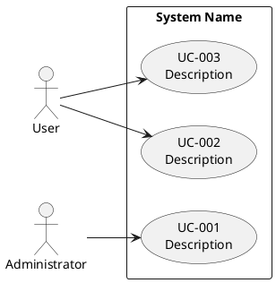

# Use Case Diagram (coverage-guaranteed fork)

A fork of the stock AIUP `use-case-diagram` skill. It produces the same
PlantUML artifact, but adds the one thing a downstream lens cannot add after the
fact: **forward coverage** — every *in-scope* functional requirement is realised
by at least one use case (or explicitly recorded as a spec-level detail), so the
diagram can never silently omit a relevant use case. (`trace-check` checks the
opposite direction, UC→FR, and so cannot catch a *missing* use case.)

It **consumes** the glossary (actor names, verbatim) and the scope marker (which
requirements are "now"); it does **not** enforce or evolve the glossary, and it
does **not** cut scope — those stay `ubiquitous-language-guard` and
`pareto-scope-cut`. Like the other forks, it adds one structural guarantee and
leaves the cross-cutting lenses to do their jobs.

## Inputs

1. **Requirements catalog** (default `docs/requirements.md`) — the functional
   requirement (FR) catalog and any "Scope split" / Status column. **Required**;
   if absent, STOP.
2. **Scope marker** (optional argument) — the milestone/phase that defines "now."
   Resolve the **in-scope FR set** from the requirements doc's Scope split /
   Status column; if no scope split is present, treat every FR whose Status is
   not `Deferred` / `Out-of-scope` as in-scope. Never hard-code a project's
   milestone names; if scope is genuinely ambiguous, **ask** rather than guess.
3. **Domain / entity model** (optional, default `docs/entity_model.md`) — read
   for the domain nouns the use cases act on, so use-case names stay
   domain-shaped.
4. **Glossary** (optional argument), resolved by a fallback chain — never a
   hard-coded filename: explicit path → `docs/CONTEXT.md` → `docs/glossary.md` →
   none found: **warn and continue**. When present, actor names are used
   **verbatim** (L1, read side only); do **not** default to the template's
   "User / Administrator" when the glossary names the actors.
5. **Existing diagram** (`docs/use_cases.puml`) — updated in place if present.

## DO NOT

- Do NOT author the diagram without reading the requirements first.
- Do NOT invent actors. Draw actor names from the glossary **verbatim**; a
  needed-but-undefined actor is **flagged** for the `ubiquitous-language-guard`
  write-back loop, never silently coined.
- Do NOT pull in deferred / out-of-scope requirements (respect the scope split /
  Status) — that is over-scope, the `pareto-scope-cut` concern inverted.
- Do NOT finish with an in-scope FR that no use case covers **and** that is not
  explicitly recorded as a spec-level detail — that coverage gap is the whole
  reason this fork exists.
- Do NOT use non-standard PlantUML syntax, or put implementation details in use
  case names.
- Do NOT enforce/evolve the glossary or cut scope here (sibling skills own those).

## Template



(Actor names above are placeholders — replace with the glossary's actors.)

## Conventions

- Use Case ID: `UC-{3-digit}` (UC-001, UC-002, …).
- Each use case is named for a **user goal**, domain-shaped — not an
  implementation step.
- Each use case traces to **at least one in-scope functional requirement**; emit
  the FR id(s) it realises (in a note or the coverage map) so `usecase-spec` and
  `trace-check` have an explicit UC→FR convention to read.
- Add notes sparingly, only where a relationship needs clarification.

## Coverage discipline (the fork's job)

Build an explicit **FR → UC coverage map**. List every **in-scope** FR and the
use case(s) that realise it. Apply the granularity rule:

- A coarse **user goal** becomes a use-case bubble.
- A **fine-grained FR** that is really an attribute of a larger goal (an error
  path, a validation, a sub-rule) need *not* be its own bubble — mark it
  **spec-level** against the bubble that owns it, to be carried as an alternative
  flow or business rule by `usecase-spec`.

Every in-scope FR must resolve to **exactly one** of: **≥1 use case**, or
**spec-level (owning UC named)**. An in-scope FR that is neither is a **coverage
gap** — surface it and do **not** report the diagram complete.

## Workflow

1. **Resolve inputs.** Resolve the in-scope FR set from the scope split / Status
   (ask if ambiguous). State which files and scope marker you used.
2. **Read** the requirements, existing `.puml`, entity model, and glossary.
3. **Identify** actors (glossary-verbatim) and candidate use cases from the
   in-scope FRs.
4. **Create/update** the PlantUML diagram.
5. **Build the FR → UC coverage map**; resolve every in-scope FR to ≥1 UC or
   spec-level (owning UC).
6. **Validate (fail-closed):**
   - every in-scope FR is covered (no coverage gap);
   - every use case traces to ≥1 in-scope FR (no fabricated use case), and the FR
     id(s) are emitted per UC;
   - all actors connect to ≥1 use case, and each actor appears in the glossary
     verbatim (flag unknown actors, do not coin them);
   - no deferred / out-of-scope FR was pulled in;
   - UC ids follow `UC-{3-digit}`; PlantUML is valid (`@startuml`/`@enduml`,
     proper arrows).
7. **Output** the diagram and the coverage map; list any gaps or flagged actors
   that block completion.

## Coverage map template

```markdown
## FR → UC coverage (against <scope marker>)

| In-scope FR | Use case(s) | or spec-level (owning UC) | Status        |
|-------------|-------------|---------------------------|---------------|
| FR-00X      | UC-001      | —                         | covered       |
| FR-00Y      | —           | spec-level → UC-001       | covered (spec)|
| FR-00Z      | —           | —                         | **GAP**       |
```
